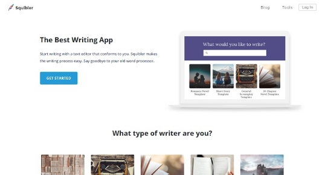

**Tugas**

<https://github.com/Arawidhi/TeknoCloud> 

1. Dari latihan no 2, buat overview masing-masing layanan tersebut dan simpan dalam file layanan-saas.md, jangan lupa sertakan juga software non-cloud yang mempunyai fungsionalitas sama.

Uraian :

### 2 layanan SaaS berbasis Cloud
Instagram (<https://www.instagram.com/>) 

Uraian :

Secara istilah Instagram diambil dari kata “Insta” yang berasal dari kata “Instan”. Nama ini diambil dari kamera polaroid dimana merupakan kamera instan yang langsung jadi seketika. Sedangkan kata “gram” diambil dari kata “Telegram” yang mampu mengirim informasi secara cepat. Dalam hal ini, kata kata yang dibuat sesuai dengan tujuan Instagram yang mampu mengirim foto dan video dalam jaringan internet secara instan dan cepat. Selain disebut Instagram, orang masa kini lebih suka menyebutnya IG atau Insta.

Fitur yang tidak kalah menarik dari instagram sendiri adalah membuat cerita keseharian kita yang diunggah dalam waktu 1x24 jam dan dapat dilihat oleh banyak orang 

Selain itu juga di Instagram terdapat aku bisnis, dimana kita bisa menjual barang produk kita dan memasarkannya menggunakan akun bisnis. Dan kita dapat mengetahui (jelajah) lebih luas mengenai seputar berita up to date setiap harinya pada bagian explore.

<https://dianisa.com/pengertian-instagram/> 

- Youtube (<https://www.youtube.com>) 

Uraian :

Youtube merupakan situs web berbagi video nomor 1 di dunia. Beberapa orang juga menyebut youtube sebagai media sosial berbasis video. sebab memang tak diragukan lagi bahwa Youtube menjadi situs yang paling pertama diakses ketika seseorang memerlukan video tertentu.Ada berbagai macam video klip yang diunggah oleh berbagai kalangan pengguna. Mulai dari tutorial, klip musik, trailer film, video edukasi, film pendek, film televisi, video blog, dan sebagainya.

Di zaman sekarang, manfaat adanya youtube menambah semangat baru bagi masyarakat ,mulai dari menyalurkan kreatifitas dan memberikan hiburan untuk orang lain, bahkan hingga mendatangkan penghasilan tambahan. Berbagai manfaat yang bisa kita dapatkan dari Youtube (baik untuk pengunggah maupun penonton) adalah:

- Berpenghasilan melalui Google AdSense
- Mempromosikan Perusahaan atau Profil Individu
- Menonton Tayangan yang Terlewat

Fitur-fitur menarik yang ada di youtube diantaranya :

- Video Anotasi

Video anotasi adalah video yang bisa diklik bagian atas atau samping video yang sedang diputar. Biasanya, video anotasi merupakan video yang masih berkaitan dengan video yang sedang diputar. 

- Autoplay

Fitur autoplay termasuk fitur baru yang dikeluarkan oleh youtube. Ketika seseorang telah selesai menonton suati video, algoritma youtube akan mengarahkan penonton ke video yang selanjutnya yang memiliki tema berkaitan dengan video yang ditonton sebelumnya.

- Kecepatan Video

Saat ini, youtube memungkinkan kita unutk mempercepat atau memperlambat kecepatan video yang diputar sesuai dengan preferensi pengunjung.

- Unduh Video

Fitur baru untuk bisa mendownload video yang ada di youtube ini sangat bermanfaat bagi para pengguna youtube. Untuk cara download video di youtube kita cukup menambahkan huruf “ss” pada url video yang sedang ditonton di antara kata “www.” dan “youtube”. 

<https://www.jurnalponsel.com/pengertian-youtube-manfaat-dan-fitur-fitur-menarik-di-youtube/> 

### Layanan SaaS yang tidak berbasis cloud
- Squibble (<https://squibble.design/branding-agency-birmingham/>) 

Uraian :

Untuk penulis pemula, Squibbler adalah aplikasi SaaS yang dapat membantu kita membangun cerita yang ingin kita ceritakan. Dapat diterapkan sebagai aplikasi di berbagai perangkat, Squibbler membantu kita menulis lebih cepat berkat penyediaan garis besar yang sudah ada.

Kita juga dapat mengatur 'pikiran' dengan baik berkat kemampuan yang diberikan aplikasi ini untuk menarik dan melepaskan potongan storyboard kita. Squibler menyertakan fitur koreksi yang tidak hanya berfungsi dengan ejaan, tetapi bahkan dapat membantu menghilangkan kalimat pasif.

